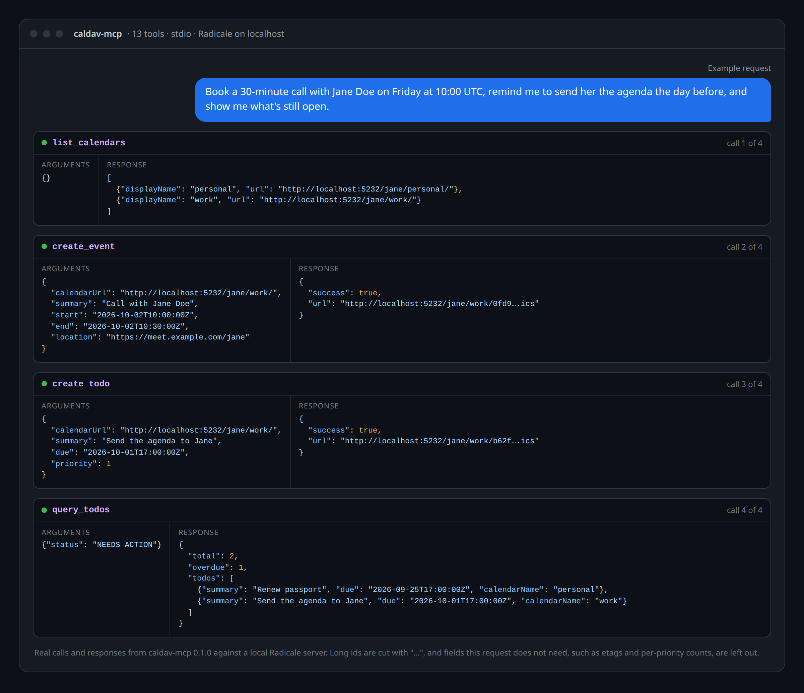

<div align="center">

# caldav-mcp

**Let your AI assistant read and manage your calendar and tasks on your own CalDAV server.**

[](https://ci.antonshubin.com/repos/6)
[](LICENSE)

[Tools and examples](https://github.com/spy4x/caldav-mcp/blob/main/docs/features.md) · [MCP clients](https://github.com/spy4x/caldav-mcp/blob/main/docs/clients.md) ·
[Self-hosting](https://github.com/spy4x/caldav-mcp/blob/main/docs/self-hosting.md) · [Configuration](https://github.com/spy4x/caldav-mcp/blob/main/docs/configuration.md) ·
[How it works](https://github.com/spy4x/caldav-mcp/blob/main/docs/how-it-works.md) · [FAQ](https://github.com/spy4x/caldav-mcp/blob/main/docs/faq.md)



</div>

caldav-mcp is a [Model Context Protocol](https://modelcontextprotocol.io/) server. Connect it to
Claude Desktop, OpenCode, Cursor, OpenWebUI or any other MCP client, and your assistant can list
your calendars, find events and tasks, and create, update or delete them on your own CalDAV
server. The request in the picture is an example. The four tool calls were sent by hand, the way an
assistant would make them, and every response is what caldav-mcp returned from a local Radicale
server.

I wrote it because the CalDAV MCP servers I tried hid tasks, could not search across calendars,
and pulled in a large npm install. I run it on my own homelab next to my calendar server.

## Why caldav-mcp

- **Events and tasks, both first-class.** Full create, read, update and delete for events
  (VEVENT) and tasks (VTODO), with ETags so two edits never overwrite each other silently.
- **One call searches every calendar.** The calendar is optional on every query, so "what is
  overdue?" is one request, not one per calendar.
- **Answers an assistant can use.** Queries return totals, counts by status and priority and the
  number of overdue tasks next to the list, capped at 200 items with a `truncated` flag.
- **No `npm install`, no `node_modules`.** Built on Deno and web standards (Fetch, Streams, ES
  modules), plus pinned libraries from JSR and npm that Deno downloads by itself, such as Hono and
  ArkType for the OAuth routes.
- **One binary.** Deno compiles it into a single executable, or runs it straight from a pinned
  URL. Docker and systemd setups are in [self-hosting.md](https://github.com/spy4x/caldav-mcp/blob/main/docs/self-hosting.md).
- **Local or remote.** stdio for desktop clients, or Streamable HTTP with a bearer token or OAuth
  for claude.ai, the Claude phone app, OpenWebUI and other networked clients.

**Use it if** your calendar lives on a CalDAV server you can reach with a username and password,
such as Radicale. **Skip it if** you need Google Calendar (its CalDAV API needs OAuth), contacts
(CardDAV) or several users from one instance. The comparison with `dav-mcp` is in
[how-it-works.md](https://github.com/spy4x/caldav-mcp/blob/main/docs/how-it-works.md#comparison).

## Quick start

Install [Deno](https://deno.com), then add this to Claude Desktop's `claude_desktop_config.json`.
`@1` accepts every 1.x release; pin an exact version such as `@1.0.0` if you want the code frozen.

```json
{
  "mcpServers": {
    "caldav": {
      "command": "deno",
      "args": ["run", "-A", "jsr:@spy4x/caldav-mcp@1"],
      "env": {
        "CALDAV_URL": "https://cal.example.com",
        "CALDAV_USERNAME": "user",
        "CALDAV_PASSWORD": "pass"
      }
    }
  }
}
```

Restart Claude Desktop and ask "Which calendars do I have?". The answer comes from
`list_calendars`. OpenCode, OpenWebUI and Cursor are in [clients.md](https://github.com/spy4x/caldav-mcp/blob/main/docs/clients.md).

## Configuration

The ones you must set:

| Variable          | Example                   |
| ----------------- | ------------------------- |
| `CALDAV_URL`      | `https://cal.example.com` |
| `CALDAV_USERNAME` | `user`                    |
| `CALDAV_PASSWORD` | `pass`                    |

The HTTP port, the bearer token, OAuth and the log level are optional: see
[configuration.md](https://github.com/spy4x/caldav-mcp/blob/main/docs/configuration.md).
Every variable is listed with a placeholder in [`.env.example`](.env.example).

## Use it from claude.ai

claude.ai, Claude Desktop and the Claude phone app can use caldav-mcp as a remote connector. They
sign in with OAuth, and you approve each one with your own password.

**1. Give it a public HTTPS address.** claude.ai connects from the internet, so the server needs a
URL such as `https://caldav-mcp.example.com`, usually a reverse proxy (Traefik, Caddy, nginx) that
terminates TLS in front of the container. Set `TRUSTED_PROXIES` to the proxy's network so the rate
limit sees each client's own address.

**2. Make the owner password hash.** Use a long random owner password, for example 24 or more
characters from a password manager. After 10 wrong passwords in 15 minutes the server stops
accepting approvals until the 15 minutes are over, so guessing is slow, but a long password is what
keeps it safe. Pick a pepper, a random secret of at least 32 characters, for example
`openssl rand -base64 48`. Then hash your password with it, from a checkout of this repository. The
task asks for the password without echoing it, so it stays out of your shell history:

```bash
AUTH_PEPPER='<your pepper>' deno task password:hash
```

**3. Set the env vars and start it in HTTP mode.**

| Variable              | Value                                                       |
| --------------------- | ----------------------------------------------------------- |
| `PUBLIC_URL`          | The public origin, `https://caldav-mcp.example.com`, no path |
| `OWNER_PASSWORD_HASH` | The `pbkdf2-sha256$…` line step 2 printed                   |
| `AUTH_PEPPER`         | The pepper from step 2                                      |
| `OAUTH_KV_PATH`       | Optional. Where tokens are kept; default `/data/oauth.kv`   |
| `HOST`                | `0.0.0.0` in a container                                    |

Set all three OAuth variables or none: with one or two the server refuses to start and names the
missing ones. `MCP_BEARER_TOKEN` is optional with OAuth on, and keeps working for clients that use
it, such as OpenWebUI.

The server keeps grants and tokens in a Deno KV file, `/data/oauth.kv` by default, so mount a
writable volume at `/data` (`compose.yml` does). Its directory must exist: if the file cannot be
opened, the server refuses to start and names the path.

**4. Add the connector.** In claude.ai open Settings → Connectors → Add custom connector, and enter
the URL with `/mcp` on the end: `https://caldav-mcp.example.com/mcp`. Leave the OAuth client ID and
secret empty.

**5. Sign in.** Claude opens a consent page on your server. It shows who is asking and where the
approval goes (`claude.ai`). Type your owner password and press **Allow**. A wrong password shows
the page again with "Wrong password. Try again." After 10 wrong passwords in 15 minutes, from anyone,
approvals get `429` until the 15 minutes are over; connectors already signed in keep working. Claude
then lists the tools, and the connector works in the Claude apps on every device signed in to your
account. A restart or a redeploy keeps it signed in.

## Development

```bash
git clone https://github.com/spy4x/caldav-mcp.git && cd caldav-mcp
CALDAV_URL=... CALDAV_USERNAME=... CALDAV_PASSWORD=... deno task dev   # hot reload
deno task check && deno task test
deno task compile   # single binary: ./caldav-mcp
```

The code layout is in [how-it-works.md](https://github.com/spy4x/caldav-mcp/blob/main/docs/how-it-works.md#architecture).

## Built by

I'm [Anton Shubin](https://antonshubin.com), a senior full-stack engineer and tech lead.
caldav-mcp is one of the tools I build and run on my own servers, and building MCP servers and AI
integrations is part of my client work. Need something like it built for your product?
[That's my day job →](https://antonshubin.com)

Licensed under [MIT](LICENSE). Copyright (c) 2026 Anton Shubin.

---

Made by Anton Shubin · [antonshubin.com/tools/caldav-mcp](https://antonshubin.com/tools/caldav-mcp)
